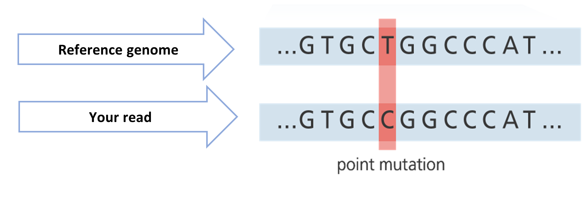

# mutfinder

**mutfinder** is a Python-based tool designed for genomic research to identify and classify mutations in DNA sequences. By comparing user-provided sequences against reference sequences retrieved from genomic databases, **mutfinder** provides detailed reports on mutations, including their impact on amino acid sequences.

---

## How does mutfinder work?

- Accepts an input sequence in FASTA format.
- Retrieves reference sequences using `gget` based on:
  - Gene symbol and species name
  - Ensembl gene ID
- Automatically identifies the longest reading frame for accurate translation
- Translates nucleotide sequences into amino acids using Bio.Seq's `translate` method
- Generates an output with detailed information on mutations, including:
  - Nucleotide and Amino Acid-level analyses.
  - Full sequence comparison results.
  - Session-wide cumulative outputs.

---

## Installation

1. Clone the repository:
   ```bash
   git clone https://github.com/b-joshua/mutfinder.git
   cd mutfinder
   ```

2. Install dependencies using `requirements.txt`:
   ```bash
   pip install -r requirements.txt
   ```

### Dependencies:

- [BioPython](https://biopython.org/docs/dev/api/Bio.Seq.html)
- [gget](https://gget.readthedocs.io/)
- [Requests](https://requests.readthedocs.io/en/latest/)
- [Pandas](https://pandas.pydata.org/)

---

## How to use mutfinder

Run **mutfinder** from the command line using the following syntax:

```bash
python3.13 mutfinder.py -seqfile <sequence_file.fasta> (-gene <gene_symbol> -species <species>) | (-ensemblid <ensembl_id>) --noncanonical
```

### Parameters:
- `--seqfile` (required): Path to the FASTA file containing the sequence to analyze.
- Either:
  - `--gene` and `--species`: Specify the gene symbol (e.g., FOXP2) and species name (e.g., Homo sapiens).
  - `--ensemblid`: Provide either an Ensembl gene ID (e.g., ENSG00000128573) or transcript ID (e.g., ENST00000408937.3).
-  `--noncanonical` (optional): Run the analysis on ALL available transcripts. By default, mutfinder uses only the canonical transcript.
**Note:** You must provide either `-gene` and `-species` together or `-ensemblid`. Both cannot be provided simultaneously.

---

## Output

**mutfinder** generates a CSV file with the following columns:

1. **Search date and time**: Timestamp of the analysis.
2. **Input gene name/ID**: Identifier for the input gene.
3. **Input nucleotide sequence**: Sequence from the input FASTA file.
4. **Translated input amino acid sequence**: Protein translation of the input sequence.
5. **Reference transcript ID**: Identifier for the retrieved reference sequence.
6. **Reference nucleotide sequence**: Sequence of the reference.
7. **Translated reference amino acid sequence**: Protein translation of the reference sequence.
8. **Input contains mutations**: Boolean indicating if mutations exist in the input sequence compared to the reference.
9. **List of nucleotide mutations**: Indicates nucleotide sequence changes between input and reference sequences (e.g. 123-del-A).
10. **List of amino acid mutations**: Indicates amino acid changes between input and reference sequences (e.g. 45-sub-F->L).
11. **Alignment Warning**: Provides a warning if the alignment between the input and reference sequences is lower than expected for the same isoform.

---

## Example input and output

### Command:

```bash
python mutfinder.py -seqfile sample.fasta -gene FOXP2 -species homo_sapiens
```


### Diagram of input-to-reference comparison:


### Sample output file:

| Search Date and Time | Input Gene/ID | Input Nucleotide Sequence | Translated Input Amino Acid Sequence | Reference Transcript ID | Reference Nucleotide Sequence | Translated Reference Amino Acid Sequence | Input Contains Mutations | List of Nucleotide Mutations                     | List of Amino Acid Mutations           | Alignment Warning                                                            |
|----------------------|---------------|---------------------------|---------------------------------------|-------------------------|------------------------------|------------------------------------------|--------------------------|--------------------------------------------------|----------------------------------------|------------------------------------------------------------------------------|
| 2025-01-10 12:34     | FOXP2         | ATG...TAA                | M...*                                 | ENST00000303444.10     | ATG...TAA                    | M...*                                    | True                     | 204-sub-A->T, 265-ins-AAA                         | sub-M->L, ins-K                        |      |


---

## Some ideas for how mutfinder can be helpful for you!

#### 1. Search your reference sequence by gene symbol and species name:
```bash
python3.13 mutfinder.py -seqfile GCG_deletion.fasta -gene GCG -species homo_sapiens
```

```bash
python3.13 mutfinder.py -seqfile TGIF2LY_SNP.fasta -gene TGIF2LY -species homo_sapiens
```

#### 2. Search your reference sequence by Ensembl gene ID:
```bash
python3.13 mutfinder.py -seqfile H2AC6_insertion.fasta -ensemblid ENSG00000180573
```

#### 3. Find the transcript that best matches your input sequence (noncanonical analysis):
```bash
python3.13 mutfinder.py -seqfile ZNF814_WT.fasta -gene ZNF814 -species homo_sapiens --noncanonical
```

Check out the results to these queries in `mutfinder_results.csv`, or run the code for yourself to see the alignment in your terminal!

---

## Citation

If you use **mutfinder**, please cite the following works for the tools and databases it leverages:

- **gget**:  
  Luebbert, L., & Pachter, L. (2023). Efficient querying of genomic reference databases with gget. *Bioinformatics.* https://doi.org/10.1093/bioinformatics/btac836  
- **Ensembl**:  
  Martin FJ et al., Ensembl 2023. *Nucleic Acids Res.* 2023 Jan 6;51(D1):D933-D941. https://doi.org/10.1093/nar/gkac958  
- **UniProt**:  
  The UniProt Consortium, UniProt: the Universal Protein Knowledgebase in 2023, *Nucleic Acids Res.* 2023 Jan 6;51(D1):D523–D531. https://doi.org/10.1093/nar/gkac1052

---

## Comments and concerns

If you have comments regarding this project, please open an **issue** in the GitHub repository **mutfinder**.

---

## Acknowledgements

- **mutfinder** was developed for sequencing data analysis in the [Barkai Lab](https://barkailab.wixsite.com/barkai).
- This project was created for the [Weizmann Institute of Science](https://www.weizmann.ac.il/pages/) [Python Course](https://github.com/szabgab/wis-python-course-2024-11) taught by [Gábor Szabó](https://szabgab.com/).
